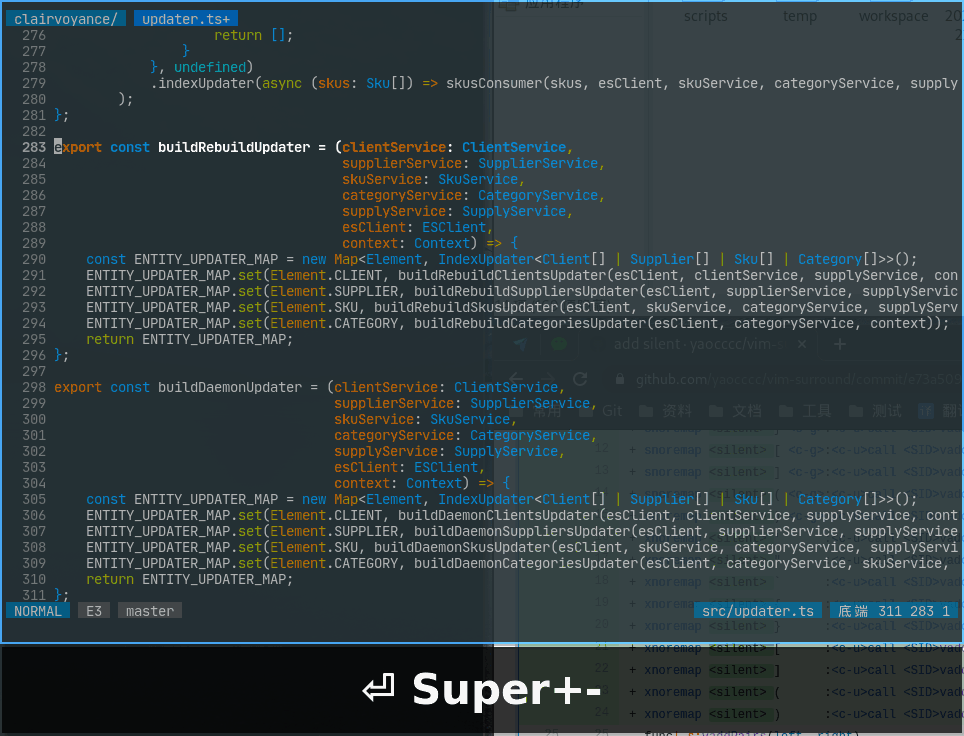

# vim-comment



## usage

```comment
  how to use
    step1: plug 'yaocccc/vim-comment'
    step2: PlugInstall
    step3: add maps to your vimrc
        nmap <silent> ?? :NToggleComment<CR>
        xmap <silent> /  :<c-u>VToggleComment<CR>
        smap <silent> /  <c-g>:<c-u>VToggleComment<CR>
        xmap <silent> ?  :<c-u>CToggleComment<CR>
        smap <silent> ?  <c-g>:<c-u>CToggleComment<CR>
```

```comment
    NToggleComment: normal mode to toggleLineComment
    VToggleComment: visual or select mode to toggleLineComment
    CToggleComment: visual or select mode to toggleChunkComment
```

```comment
    NToggleComment: 普通模式下 切换 行注释状态
    VToggleComment: 选择模式(鼠标或键盘)模式下 切换行注释状态
    CToggleComment: 选择模式(鼠标或键盘)模式下 切换块注释状态
```

## options

```options
  set comments of filename suffix
  default:
    let g:vim_line_comments = { 'vim': '"', 'vimrc': '"',
                             \  'js': '//', 'ts': '//',
                             \  'java': '//', 'class': '//',
                             \  'c': '//', 'h': '//',
                             \  'default: '#',
                             "   or use filename key
                             \  'go.mod': '//'}
                             }
    let g:vim_chunk_comments = {'vim': ['"', '"', '"'],
                             \  'vimrc': ['"', '"', '"'],
                             \  'sh': [':<<!', '', '!'],
                             \  'md': ['```', '', '```'],
                             \  'default': ['/*', ' *', ' */'],
                             "   or use filename key
                             \  'go.mod': ['/*', ' *', ' */']}

  the space length between the comment and the content
    let g:vim_comment_gap = 1

  some map to toggleComment
  example:
    nmap <silent> ?? :NToggleComment<CR>
    xmap <silent> /  :<c-u>VToggleComment<CR>
    smap <silent> /  <c-g>:<c-u>VToggleComment<CR>
    xmap <silent> ?  :<c-u>CToggleComment<CR>
    smap <silent> ?  <c-g>:<c-u>CToggleComment<CR>
```

```options
  为不同的文件后缀或文件名设置注释
  默认:
    let g:vim_line_comments = {  'vim': '"', 'vimrc': '"',
                             \  'js': '//', 'ts': '//',
                             \  'java': '//', 'class': '//',
                             \  'c': '//', 'h': '//',
                             \  'default: '#',
                             "   也可以使用文件名进行过滤
                             \  'go.mod': '//'}
    let g:vim_chunk_comments = {'vim': ['"', '"', '"'],
                             \  'vimrc': ['"', '"', '"'],
                             \  'sh': [':<<!', '', '!'],
                             \  'md': ['```', '', '```'],
                             \  'default': ['/*', ' *', ' */'],
                             "   也可以使用文件名进行过滤
                             \  'go.mod': ['/*', ' *', ' */']}

  自定义注释标记和被注释内容的间隔空格长度
    let g:vim_comment_gap = 1

  自定义快捷键
  例如:
    nmap <silent> ?? :NToggleComment<CR>
    xmap <silent> /  :<c-u>VToggleComment<CR>
    smap <silent> /  <c-g>:<c-u>VToggleComment<CR>
    xmap <silent> ?  :<c-u>CToggleComment<CR>
    smap <silent> ?  <c-g>:<c-u>CToggleComment<CR>
```
